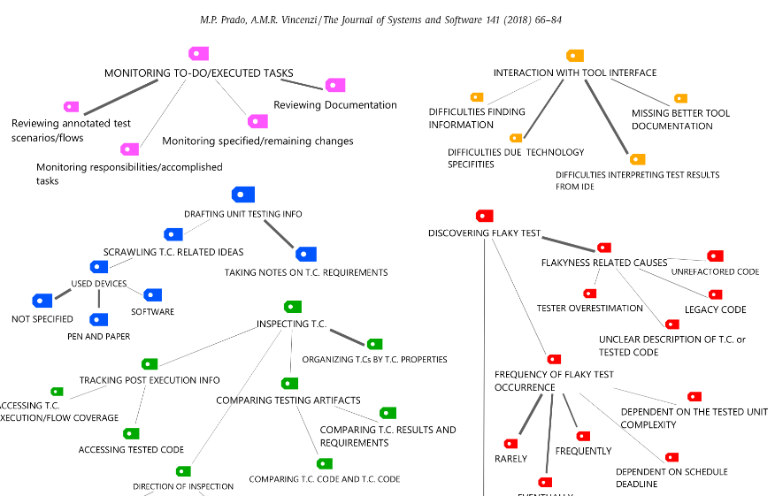
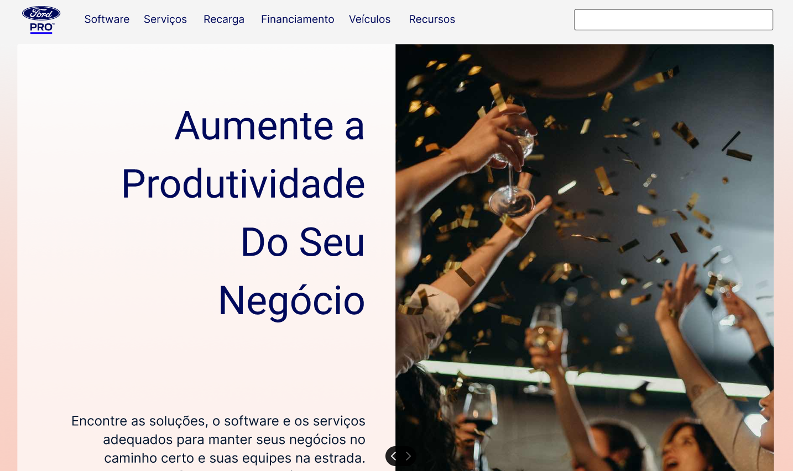
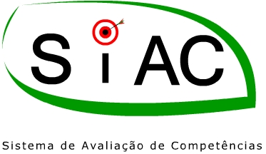
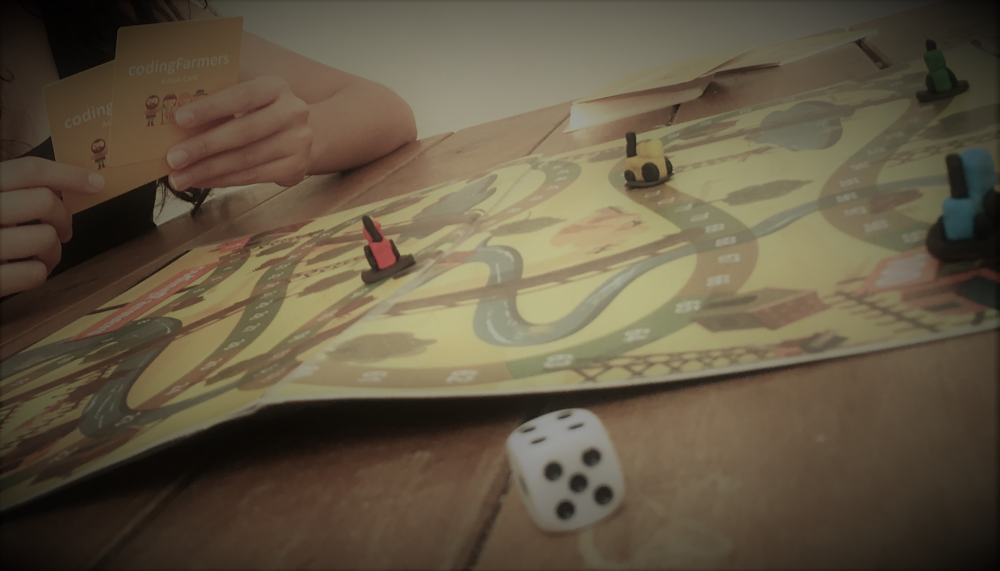
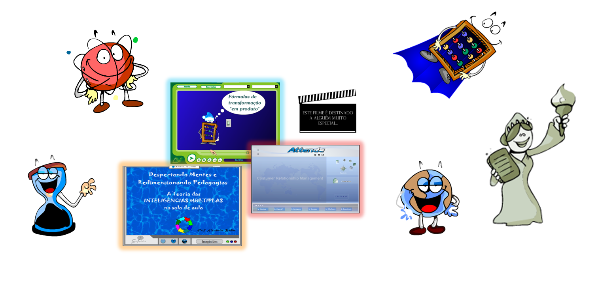

<!--

-->
            
 
 

Welcome visitor! Here you'll find information about me and my work. Connect to my social networks – for <a target="_blank" href="mailto: marllosprado@gmail.com">feedback, </a> <a target="_blank" href="https://www.linkedin.com/in/marllos-p-a383641b2">professional contact</a>, or just the old good <a target="_blank" href="https://twitter.com/MarllosP">friendship</a>.

 
 
 

<!--
####
* * *
####

## Me in less than 200 words
#### A mix of curiosity, accessibility and avocados. 

 🦝 + 👨‍🦽 + 🥑 

Long story short, I was a young STEAM (Science, Technology, Engineering, and Mathematics) passionate boy, born in the 80/90’s, who grew up into a 36-year-old User Experience (UX) enthusiast, tech curious, and nature lover. So yes, the child alive inside me keeps bugging me to constantly analyze my numerous daily experiences as a user going from the new gadgets and packages on the market shelf to the accessibility issues in the closest pharmacy store -- which weirdly request that people have a car in order to get tested for Covid-19 (no, no pedestrian in the drive-thru, nor alternative option)! It is also this inner energy that motivates me to disassemble and reassemble my (and my friends') broken devices, just for the sake of curiosity and self-compensation if I succeed in bringing them back to life. Oh, and last but not least, there is a lot of this youth solicitude behind the many hours I spent along my life planting the seeds of my foods -- avocados in special, as they look too chock-full of life to be trashed away after giving me a delicious matinal avo-shake!

My professional story remounts the beginning of the 2000s when, as a teenager, I got my first part-time job as a multimedia developer for high-school classes. It was a fantastic digital creativity experience that helped me fall in love with many activities later coined under the User Experience label. It also gave me the confidence to join the Computer Science program two years later. During my CS program, I could sharpen my scientific mindset and improve my problem-solving skills, which opened up the opportunity for my post-graduate studies.
      
      
During my post-graduation program, I observed that communities of practice often reported testing tools to be cumbersome and provided low support for test practitioners in their daily activities. To address this user-developer experience problem, I researched the lack of cognitive support provided by unit testing tools. The project included a qualitative study of real-world practitioners that led to a comprehensive understanding of the pain points and actionable recommendations for effectively addressing them. In parallel to my post-graduating studies, I spent one year as visiting researcher at the University of Victoria (UVic) under the excellent supervision of Professor Dr. Margaret-Anne Storey. Concurrent to my post-graduation, I developed a career as a teacher (teaching courses like HCI, UX, Algorithms, and Computing Foundations).
      
      
After moving to the USA, I enrolled in the Reskill Americans Bootcamp in 2021. In this Bootcamp, I had the opportunity to develop more tacit knowledge of User Experience Research and Design practices. During this seven-month program, I learned from fantastic mentors and networked with people from diverse backgrounds. To summarize, my career slowly brought me back to the UX Researcher/Designer pathway-- and I am super thankful for this fate!

 
 
 
-->

<h2 id="bio">My route to Computer Science and User Experience</h2>  
#### ... Systems and Humans, always in the loop...

 🤖 || 🧐 

My professional story remounts the beginning of the 2000s when, as a teenager, I got my first part-time job as a multimedia developer for high-school classes in Brazil. It was a great first job experience that helped me fall in love with technology as a tool to support education. It also gave me the confidence to join the Computer Science (CS) program two years later. During my CS program, I could sharpen my analytical mindset and improve my problem-solving skills, which opened up the opportunity for my post-graduate studies. Concurrent with my post-graduation, I developed a career as a CS teacher.
      
      
After moving to the USA, I got a CompTIA Project + certification and enrolled in the Reskill Americans UI/UX Bootcamp in 2021. In this Bootcamp, I had the opportunity to learn more about User Experience, Design practices and better understand how the software development industry works in the USA. During this seven-month program, I learned from great mentors and networked with people from diverse backgrounds. The more I learn about UX Research and Design, the more I become passionate about how humans collaborate in the use of technology to leverage their solutions to daily problems.
   

      
      
   

<h2 id="portfolio">My Portfolio</h2> 

#### Cognitive Support for Unit Testing - 🧠🧪🧠

 

 

In this project, I identified and characterized a research problem regarding the lack of user research for testing tools. I planned, conducted, and analyzed a qualitative study of practitioners to further understand the problem in the unit testing domain. The project's results and contributions include a framework and research agenda. They serve as actionable instruments for the testing community to incorporate practical improvements in cognitive support provided by current and future testing tools. Cognitive support is a key concept in offloading the users' memory during tools usage and has a direct impact on the improvement of their experience during the tasks performed.

<a target="_blank" href="https://github.com/pradoprojects/Publications">See more about this project...</a>

 
 

#### HCI/UX Classes - 📚📚📚

 

 

Here you can check materials and videos from my HCI and UX classes.

<a target="_blank" href="https://github.com/pradoprojects/UX-Classes">See more about this project...</a>

 
 

#### LetMHelp! App - 📱🎓📱

 

 

LetMHelp! was designed under the Reskill Americans Program as a team project carried out by my teammates and me. We designed and implemented an App to support self-learning students to find and connect to voluntary tutors in the tech field. I was the UX/UI designer of my team, and my duties involved going through the Defining, Ideating, and Prototyping stages. I was also responsible for defining and designing the name and logo of the App. 

<a target="_blank" href="https://github.com/pradoprojects/Self-Learning-App">See more about this project...</a>

 
 

#### Oracle Health Case Study - 👨‍⚕💻👩‍⚕

 

 

This is a high-fidelity landing page for a hypothetical solution that aligns with the ideas envisioned by Dr. David Feinberg, MD, based on the valuable patient data collected by him and his team over the years. This small-yet-applicable project aims to showcase some of my design dexterities in translating abstract concepts into tangible visual representations.

<a target="_blank" href="https://www.figma.com/file/u5t510VvPIcmgNc0QoopWi/Design-critique---Oracle-Sample?type=whiteboard&node-id=0-1&t=Bvo6T3NenlNTT88q-0"> See more about this project...</a>

 
 

#### Ford Pro Case Study - 👨‍⚕💻👩‍⚕

 

 

After visiting the Ford Pro web page, I noticed that the US version of the website was only provided in English. So I took this opportunity to redesign the landing page in Brazilian Portuguese, targeting the vibrant Portuguese-speaking community in the United States (including over 200,000 Portuguese-owned and 100,000 Brazilian-owned businesses). The objective was to provide a website copy and design that resonates with their culture and values, enabling them better to understand the innovative and technological concepts of Ford Pro. This idea can be easily extended to Spanish, the second language most spoken in the US. Next up, you can check the prototype showcasing this design.

I also included comments indicating the reason behind some design decisions (Please log in to Figma to see the comment balloons). This proactive approach demonstrates my commitment to understanding and addressing user pain points with impactful design solutions.

<a target="_blank" href="https://www.figma.com/proto/JiOtYwUav33eHLINfwTW83/Ford-Pro-Case-Study?type=design&node-id=69-49&scaling=min-zoom&page-id=0%3A1&starting-point-node-id=69%3A3"> See more about this project...</a>

 
 

#### WorldCitizen DonActor App - 🎁👖🎁

 

 

DonActor App was my first project at Reskill Americans Program. The app was intended to facilitate the donation process of clothes. In this project, I conducted the five design thinking stages (Empathize, Define, Ideate, Prototype, Test). I designed the UX/UI for the app as well as the name and Logo.

<a target="_blank" href="https://github.com/pradoprojects/DonActor">See more about this project...</a>

 
 

#### SiAC - 👩‍🌾🧪👨‍🌾 

 

 

I developed this system to help automate the process of evaluation between employees of a corporation that I worked for, in the Agricultural Research field.

<a target="_blank" href="https://github.com/pradoprojects/SiAC">See more about this project...</a>

 
 

#### Seedlers App - 🍅🥕🥔 [In Progress]

 

 

This is an ongoing project to design an app that will let plant enthusiasts connect to each other and share seeds/cuttings/ tips of their plants with other gardeners. The idea is to leverage users' well-being and environmentally sustainable attitudes by nurturing communities that share a common interest in plants.

<a target="_blank" href="https://github.com/pradoprojects/Seedlers">See more about this project...</a>

 
 

#### Algorithms and Programming for Beginners - 👩‍💻🧩👨‍💻

 

 

The APB project was dedicated to Brazilian high-school-level students that wished to learn how to program. The project focused on developing their algorithmic thinking in an innovative and unprecedented class experience - rather than just focusing on a programming language in the traditional way.
 
 
The project encompassed playful activities such as handcrafting bracelets with the student's initials in binary ASCII representation, cardboard games, problem-solving challenges, and team challenges mixed with computer programing.

<a target="_blank" href="https://github.com/pradoprojects/Project-APB">See more about this project...</a>

 
 

#### Master Degree - 📚📚📚

 

 

In this project (2007), I planned, designed, and conducted an experimental study to characterize and evaluate the cost and strength of white-box and black-box testing criteria, comparing object-oriented and procedural programs.

<a target="_blank" href="https://github.com/pradoprojects/MasterDegree_Artifacts">See more about this project...</a>

 
 

#### Multimedia Flash Projects - 📚🎞🎨

                                                    
  

 

Here you can check multimedia/animation projects for educational purposes that I developed in the early 2000s.

  
<a target="_blank" href="https://github.com/pradoprojects/Multimedia-Flash-Projects">See more about this project...</a>

 
 

#### Data Structure Classes - 📚📚📚

 

 

Here you can check materials and videos from my Data Structure Classes.

<a target="_blank" href="https://github.com/pradoprojects/DataStructures_Java">See more about this project...</a>

 
 

#### Other Projects

 <a target="_blank" href="https://github.com/pradoprojects">  You can also check other projects that I designed/wrote/coded along my career in my GitHub repository. </a> 

 
 

<h2 id="UX">My thoughts on the role of User Experience</h2> 
#### Cuisine with a grain of Class.

  👨‍🍳 && 👨‍🏫 

In the same way, STEAM activities were a thing way before someone coined a name; I consider that User Experience took the same evolutionary route. Both are an amalgam of practical and multidisciplinary concepts that we finally have a name to designate.

From my perspective, User Experience shares a lot of commonalities with gastronomy and teaching: It doesn’t matter the number of ingredients or load of theoretical knowledge you have at your disposal. If you can’t put things nicely together for YOUR audience, you’ll fail to captivate them, convey your message and create a remarkable memory. I am not saying you must be awarded the equivalent of a Michelin or Global Teacher Prize before adventuring yourself into the UX field. But your UX design output must at least provoke similar feelings to that memorable dish that you tasted a decade ago during a trip in a remote underrated restaurant -- or the classes of that teacher in your old school who immersed you and your classmates in a journey through space and time. In this sense, I’d risk saying that UX is part art, part science, but invariably driven by PURPOSE in every point of decision -- put in or taken out.  

As precisely coined by Louis Sullivan: “Form follows function.” This max should guide all the points of decisions in a project that considers UX. This means that the focus for modeling the solution should not be on the product or service alone but in the story that the person will live when in contact with the designed experience. It can’t come before or after, but along and intertwined in the project. Thus, developing UX skills entail two major aspects: sharpening empathy and critical sense in ourselves. 

 
#### 👂 Empathy  

Empathy is directly connected to the artistic portion of UX. Without empathy, you can’t wear somebody’s shoes and truly access their necessities, emotions, aims, and claims. Put simply for Marvel fans, a lack of empathy in UX is your passport into Wandavision World. For non-marvel fans, lack of empathy is your passport for wishful thinking… You will fail to provide an effective experience because you will be mirroring your inner feelings in the design. It can sound true, vibrant, and energetic to you. But putting it in perspective, it is as ineffective as you trying to recognize yourself in a mirror that reflects somebody else’s image.  This is easier said than done. The good news is that you can always revive and channel empathy towards design if caring about people is something that triggers your self-reward mechanism. Surely, it does in me.

 
#### 🔬 Critical Sense

I tend to see critical sense as the main scientific skill demanded in User Experience Research. By sharpening your critical sense, you are mastering your ability to take different perspectives in the analyses of the problem. That means you must be relentlessly open to evaluating and reevaluating the problem and the methods employed. You shall visit past successes and failures in similar and opposite projects. You must be willing to break apart and recombine the original problem, and flip it upside-down as many times as possible until the “form follows function” key is activated. True critical sense demands high doses of persistence and resilience to failure. Of course, the “fail fast, learn fast” approach is always welcome when it fits the problem. But as history teaches us, Thomas Edison made around 1K unsuccessful attempts at inventing the light bulb. In such cases, recalibrating the speed of “fast” can be an exercise of humbleness and acknowledging boundaries. Nonetheless, no one can deny the impact that electrical light had on modern life experience.

 
 
 

<h2 id="Readings">Books and Readings</h2> 

Below are some book references that I like to read, consult and skim through.

- [Human-Computer Interaction](https://www.amazon.com/dp/0130461091/ref=cm_sw_r_tw_dp_SJFH5RA08NZ6HE6WP983) 
- [Interaction Design: Beyond Human-Computer Interaction by Helen Sharp](https://www.amazon.com/dp/1119547253/ref=cm_sw_r_tw_dp_PCHGZED2CQAB2C2DW180?_encoding=UTF8&psc=1) 
- [The Design of Everyday Things](https://www.amazon.com/Design-Everyday-Things-Revised-Expanded/dp/0465050654)
- [Don't Make Me Think!](https://www.amazon.com/Dont-Make-Me-Think-Usability/dp/0321344758)
- [Writing is Designing](https://rosenfeldmedia.com/books/writing-is-designing/)
- [Prototyping](https://rosenfeldmedia.com/books/prototyping/)
- [The User’s Journey](https://rosenfeldmedia.com/books/storymapping/)
- [Surveys That Work](https://rosenfeldmedia.com/books/surveys-that-work/)
- [Figure It Out: Getting from Information to Understanding](https://rosenfeldmedia.com/books/figure-it-out/)
- [Universal Principles of Design](https://www.amazon.com/Universal-Principles-Design-Revised-Updated/dp/1592535879)
- [Lean UX](https://www.amazon.com/Lean-UX-Applying-Principles-Experience/dp/1449311652)
- [Blind Spot](https://rosenfeldmedia.com/books/blind-spot/)
- [The Jobs To Be Done Playbook](https://rosenfeldmedia.com/books/jobs-to-be-done-book/)
- [About Face: The Essentials of Interaction Design](https://www.amazon.com/About-Face-Essentials-Interaction-Design/dp/1118766571)
- [Orchestrating Experiences](https://rosenfeldmedia.com/books/orchestrating-experiences/)
- [The User Experience Team of One](https://rosenfeldmedia.com/books/the-user-experience-team-of-one/)
- [Sprint: How to Solve Big Problems and Test New Ideas in Just Five Days](https://www.amazon.com/Sprint-Solve-Problems-Test-Ideas/dp/150112174X/ref=sr_1_1?dchild=1&keywords=Sprint%21&qid=1631310196&s=books&sr=1-1)
- [Just Enough Research](https://abookapart.com/products/just-enough-research) 
- [DataStory](https://www.amazon.com/dp/1940858984/ref=sspa_dk_detail_6?psc=1&pd_rd_i=1940858984&pd_rd_w=01yrs&pf_rd_p=91afecf5-8b2e-41e2-9f11-dc6992c6eaa1&pd_rd_wg=C4L5Q&pf_rd_r=HB323TR2SVHVC51217MN&pd_rd_r=43ed2a4e-2c91-4265-99d7-af8e02d8aa06&spLa=ZW5jcnlwdGVkUXVhbGlmaWVyPUExUTNTQ0pXRkNVOUFDJmVuY3J5cHRlZElkPUEwNTAzNjE3MzM0TjJURTVBVE9PVSZlbmNyeXB0ZWRBZElkPUEwMTIyMjY5MTdSQlVYNUFISkNDUSZ3aWRnZXROYW1lPXNwX2RldGFpbCZhY3Rpb249Y2xpY2tSZWRpcmVjdCZkb05vdExvZ0NsaWNrPXRydWU=)
- [Handbook of Usability Testing](https://www.amazon.com/Handbook-Usability-Testing-Conduct-Effective/dp/0470185481/ref=sr_1_1?dchild=1&keywords=Handbook+of+Usability+Testing&qid=1626719142&sr=8-1)
- [Remote Research](https://rosenfeldmedia.com/books/remote-research/)
- [Research Design](https://www.amazon.com/Research-Design-Quantitative-Community-Based-Participatory/dp/1462514383/ref=as_li_ss_tl?keywords=quantitive+ux+research&qid=1575837320&s=books&sr=1-2-fkmr0&linkCode=sl1&tag=designtalks-20&linkId=7f9f560d078142d8eb102d61a0c1f582&language=en_US)
- [Validating Product Ideas: Through Lean User Research](https://rosenfeldmedia.com/books/lean-user-research/)
- [Card Sorting](https://rosenfeldmedia.com/books/card-sorting/)
- [Interviewing Users](https://rosenfeldmedia.com/books/interviewing-users/)
- [Cognitive Psychology](https://www.amazon.com/dp/1305644654/ref=cm_sw_r_tw_dp_RESXS179F7GXDDTC69WJ?_encoding=UTF8&psc=1) 
- [https://www.designsystemsforfigma.com/](https://www.designsystemsforfigma.com/)

