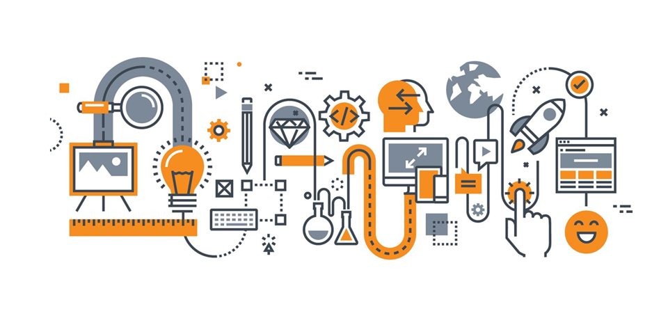
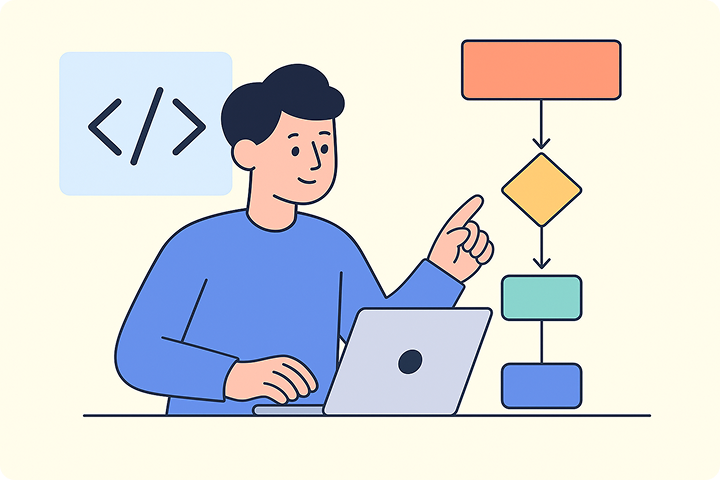
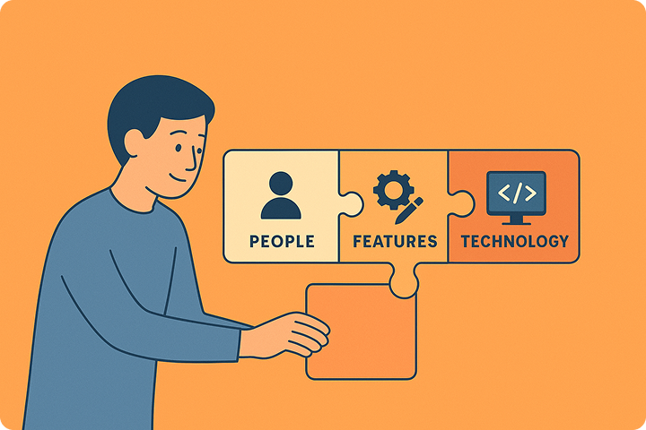
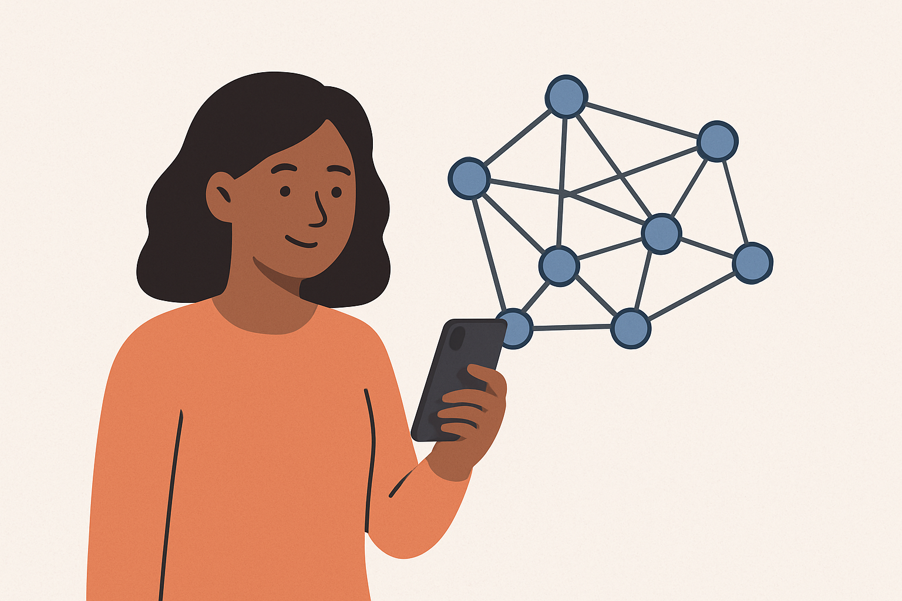

<button id="theme-toggle" aria-label="Ativar tema escuro" aria-pressed="false">
  🌙
</button>

<!-- TOP MENU -->
<nav id="top-menu">
  <button id="menu-toggle" aria-label="Abrir menu">☰</button>
  <ul>
    <li><a href="#home">Home</a></li>
    <li><a href="#how-i-think">How I Think</a></li>
    <li><a href="#featured-work">Featured Work</a></li>
    <li><a href="#improving">Improving</a></li>
    <li><a href="#tools">Tools</a></li>
    <li><a href="#contact">Contact</a></li>
  </ul>
</nav>

<!-- HOME -->
<section id="home">
  <h1>Hi, I’m Marllos 👋</h1>
  <h3>Early-career UX & Product Designer | Focused on clarity and thoughtful problem-solving.</h3>
  <blockquote>
    <h4>I’m building a career shaped by <em>continuous learning</em>, <em>multicultural experiences</em>, and bringing the <em>human front & center</em> to each decision.</h4>
  </blockquote>

  

    
  

  <h4><em>... But what does it mean?</em></h4>
  <blockquote>
    It means I care about crafting UI/UX that feels intuitive, calm, and accessible — especially for people who don’t consider themselves “techy.”
  </blockquote>
</section>

<!-- HOW I THINK -->
<section id="how-i-think">
  <h2>How I Think 💡</h2>

  <h3>Simplifying complexity</h3>
  

    
    

      Teaching basic programming to teenagers showed me how to break down abstract concepts into clear, approachable steps — a skill that directly shapes how I build interfaces and structure information.
    

  

  <h3>Designing with empathy</h3>
  

    
    

      Working with people of different ages and cognitive/physical needs strengthened my observation skills, patience, and adaptability. These experiences help me identify friction and design for comfort, not just functionality.
    

  

  <h3>Human-first, tech-aware</h3>
  

    
    

      My computer science background helps me understand constraints and feasibility, but my design decisions always begin with people, not features.
    

  

</section>

<!-- FEATURED WORK -->
<section id="featured-work">
  <h2>Featured Work 🎬</h2>
  
<em>Quick, visual, easy to scan. Full case studies coming soon.</em>

  

    

      

        
      

      <h3>Project APB — Learning Through Play</h3>
      
A hands-on STEAM activity that helps teens explore computing concepts through creativity.

      
<strong>Skills:</strong> research · ideation · rapid prototyping · visual structure

      
<strong>Focus:</strong> why it was built · what I learned · what I’d improve

      Case study coming soon
    

    

      

        
      

      <h3>Self-Learning App — Mobile UX</h3>
      
A concept app that helps users learn new skills at their own pace through simple navigation and a clear task flow.

      
<strong>Skills:</strong> wireframes · flows · usability considerations

      
<strong>Focus:</strong> how early feedback shaped the design

      Case study coming soon
    

  

</section>

<!-- IMPROVING -->
<section id="improving">
  <h2>What I’m Improving 🧱</h2>
  <ul>
    <li>Visual design fundamentals and layout clarity</li>
    <li>Faster, more intentional prototyping in Figma</li>
    <li>Usability testing → synthesis → decision-making</li>
    <li>Studying real products to understand interaction patterns</li>
  </ul>
</section>

<!-- TOOLS -->
<section id="tools">
  <h2>Tools 🛠</h2>
  
Figma • Miro • Basic HTML/CSS • GitHub • Pen & Paper

</section>

<!-- CONTACT -->
<section id="contact">
  <h2>Let’s Connect 🤝</h2>
  
Whether you’re a recruiter, designer, or someone curious about my work — welcome.

  
marllospaiva@gmail.com • <a href="https://www.linkedin.com/in/marllos-p-a383641b2">LinkedIn</a>

</section>

