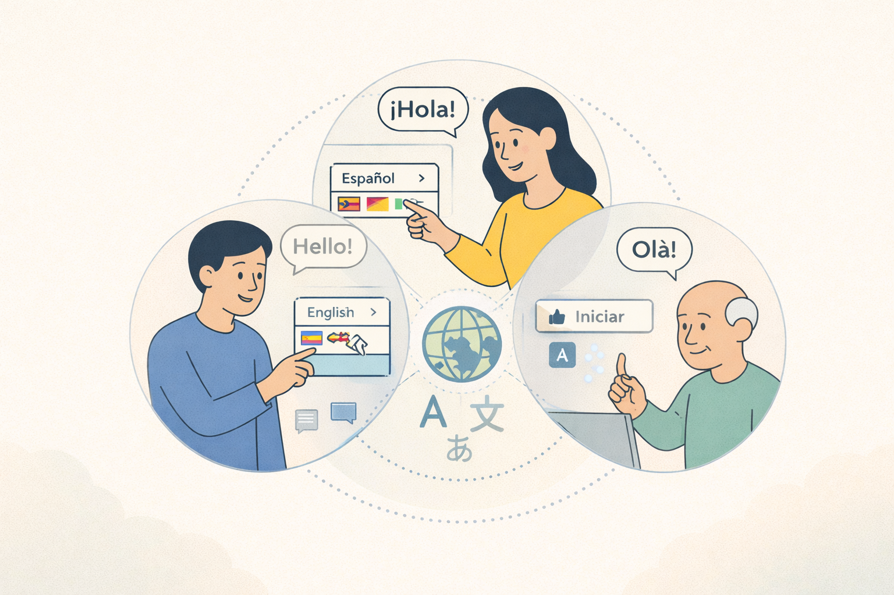
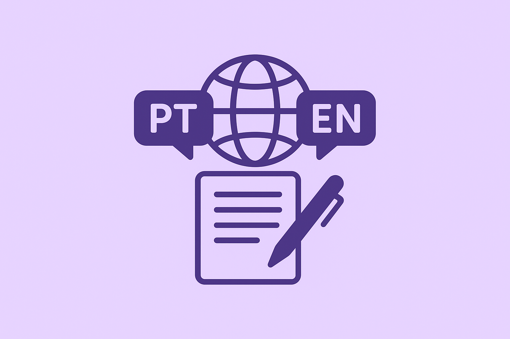
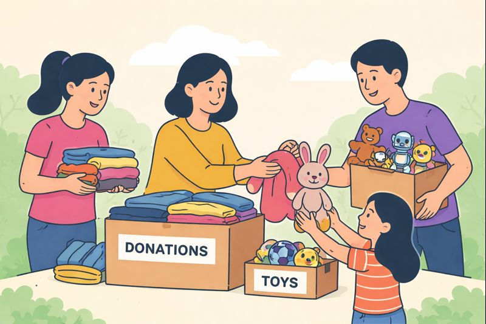

<a class="skip-link" href="#main">Pular para o conteúdo</a>

<nav id="top-menu" role="navigation" aria-label="Menu principal">
    <button id="menu-toggle" aria-label="Abrir menu" aria-expanded="false" aria-controls="top-menu-list">
        ☰
    </button>
    <ul id="top-menu-list" aria-hidden="true">
        <li><a href="#home">Home</a></li>
        <li><a href="#how-i-think">How I Think</a></li>
        <li><a href="#featured-work">Featured Work</a></li>
        <li><a href="#improving">What I’m Improving</a></li>
        <li><a href="#tools">Tools</a></li>
        <li><a href="#contact">Contact</a></li>
    </ul>
</nav>

<button id="theme-toggle" aria-label="Toggle theme" aria-pressed="false">
    🌙
</button>

<main id="main" tabindex="-1">

<section id="home">
    <h1>Hi, I’m Marllos 👋</h1>
    <h3>UX & Localization Specialist (PT-BR ↔ EN) | Human-Centered Problem Solver</h3>

    <blockquote>
        <h4>
            I’m building a career shaped by <em>continuous learning</em>, <em>multicultural experiences</em>,
            and the intersection between <em>user experience, language, and digital products</em>.
        </h4>
    </blockquote>

    

        
    

    <h4><em>... But what does that mean in practice?</em></h4>
    <blockquote>
        It means I design and localize with clarity, accessibility, and emotional comfort in mind —
        especially for people who feel underserved or overwhelmed by technology.
    </blockquote>
</section>

<section id="how-i-think">
    <h2>How I Think 💡</h2>

    <h3>Simplifying complexity</h3>
    

        
        

            Teaching programming taught me to break down abstract ideas into clear, approachable steps —
            the same mindset I use to structure interfaces and reduce cognitive load.
        

    

    <h3>Designing with empathy</h3>
    

        
        

            Working closely with people across ages and abilities sharpened my observation skills,
            helping me identify friction and design for clarity and emotional ease.
        

    

    <h3>Human-first, tech-aware</h3>
    

        
        

            My computer science background helps me understand constraints — but every decision starts
            with people, not technology.
        

    

    <h3>Designing through language</h3>
    

        
        

            Language shapes perception, trust, and usability. Localization trained me to see interfaces
            as linguistic systems where tone and clarity directly impact experience.
        

    

</section>

<section id="featured-work">
    <h2>Featured Work 🎬</h2>

    

        

            

                
            

            <h3>Self-Learning App — Mobile UX</h3>
            
A concept app connecting learners and volunteer mentors.

            
<strong>Skills:</strong> wireframes · flows · usability

            <a class="card-cta" href="https://github.com/pradoprojects/Self-Learning-App">Learn More</a>
        

        

            

                
            

            <h3>Project APB — Learning Through Play</h3>
            
Hands-on STEAM learning through creativity and play.

            
<strong>Skills:</strong> research · ideation · prototyping

            <a class="card-cta" href="https://github.com/pradoprojects/Project-APB">Learn More</a>
        

        

            

                
            

            <h3>Localization & Linguistic QA</h3>
            
UX-driven localization focused on clarity, tone, and cultural nuance.

            
<strong>Skills:</strong> localization · UX writing · QA

            <a class="card-cta" href="https://github.com/pradoprojects/Translation_QA_Projects/">View samples</a>
        

        

            

                
            

            <h3>DonActor — Donation UX</h3>
            
A self-initiated UX project exploring frictionless donation.

            
<strong>Skills:</strong> research · wireframes · prototyping

            <a class="card-cta" href="https://github.com/pradoprojects/DonActor">Learn More</a>
        

    

</section>

<section id="improving">
    <h2>What I’m Improving 🧱</h2>
    <ul>
        <li>Visual design foundations and layout clarity</li>
        <li>Faster and more intentional prototyping</li>
        <li>Usability testing → synthesis → decisions</li>
        <li>Advanced UX writing & linguistic QA workflows</li>
    </ul>
</section>

<section id="tools">
    <h2>Tools 🛠</h2>
    

        I start with <strong>pen & paper</strong>, move into <strong>Figma</strong> and <strong>Miro</strong>,
        and shift to <strong>HTML/CSS</strong> and <strong>GitHub</strong> when technical awareness improves decisions.
        For localization: <strong>MemoQ</strong>, <strong>MateCat</strong>, and terminology workflows.
    

</section>

<section id="contact">
    <h2>Let’s Connect 🤝</h2>
    

        <a href="mailto:marllospaiva@gmail.com">marllospaiva@gmail.com</a> •
        <a href="https://www.linkedin.com/in/marllos-p-a383641b2">LinkedIn</a>
    

</section>

</main>

