<a class="skip-link" href="#main">Pular para o conteúdo</a>

<nav id="top-menu" role="navigation" aria-label="Menu principal">
    <button id="menu-toggle" aria-label="Abrir menu" aria-expanded="false" aria-controls="top-menu-list">
        ☰
    </button>
    <ul id="top-menu-list" aria-hidden="true">
        <li><a href="#home">Home</a></li>
        <li><a href="#how-i-think">How I Think</a></li>
        <li><a href="#featured-work">Featured Work</a></li>
        <li><a href="#information-design">Information Design</a></li>
        <li><a href="#improving">What I’m Improving</a></li>
        <li><a href="#tools">Tools</a></li>
        <li><a href="#contact">Contact</a></li>
    </ul>
</nav>

<button id="theme-toggle" aria-label="Toggle theme" aria-pressed="false">
    🌙
</button>

<main id="main" tabindex="-1">

<section id="home">
    <h1>Hi, I’m Marllos 👋</h1>
    <h3>UX, Localization & Information Design</h3>

    <blockquote>
        <h4>
            I’m building a career shaped by <em>continuous learning</em>, <em>multicultural experiences</em>,
            and the intersection between <em>user experience, language, and digital products</em>.
        </h4>
    </blockquote>

    

        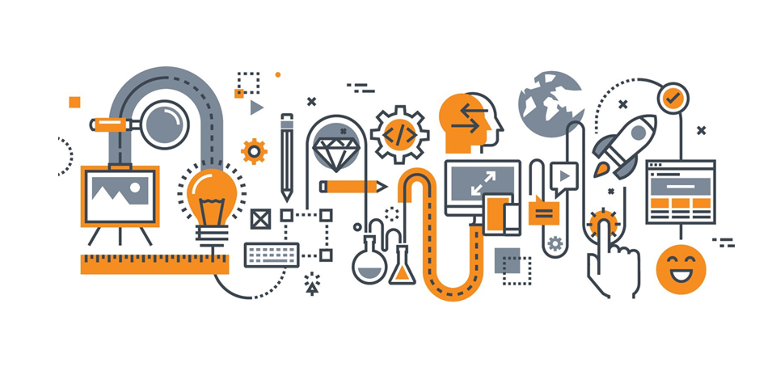
    

    <h4><em>... But what does that mean in practice?</em></h4>

    <blockquote>
        I design and communicate information to improve clarity, usability, and decision-making.
        My work sits at the intersection of user experience, content, and knowledge management —
        from interfaces and learning materials to multilingual communication and digital systems.
    </blockquote>
</section>

<section id="how-i-think">
    <h2>How I Think 💡</h2>

    <h3>Simplifying complexity</h3>
    

        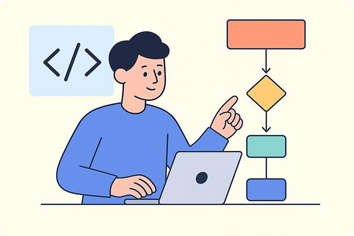
        

            Teaching programming taught me to break down abstract ideas into clear, approachable steps —
            the same mindset I use to design interfaces and reduce cognitive load.
        

    

    <h3>Designing with empathy</h3>
    

        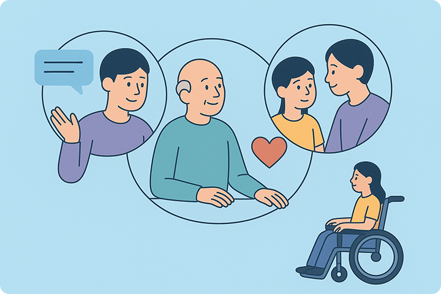
        

            Working closely with people across ages and abilities sharpened my observation skills,
            helping me identify friction and design for clarity and emotional ease.
        

    

    <h3>Human-first, tech-aware</h3>
    

        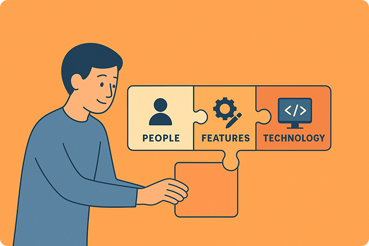
        

            My computer science background helps me understand constraints — but every decision starts
            with people, not technology.
        

    

    <h3>Designing through language</h3>
    

        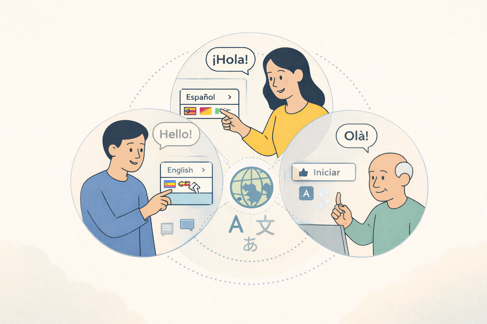
        

            Language shapes perception, trust, and usability. Localization trained me to see interfaces
            as systems where clarity, tone, and communication directly impact experience.
        

    

</section>

<section id="featured-work">
    <h2>Featured Work 🎬</h2>

    

        <!-- 1 -->
        

            

                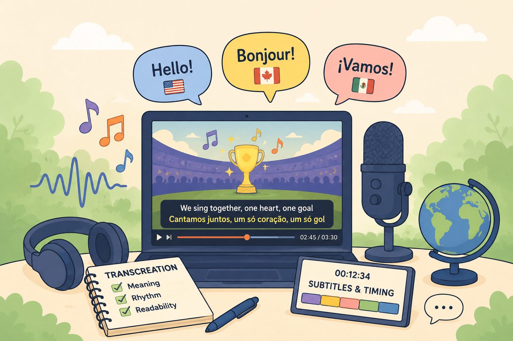
            

            <h3>Catch the Cup — Multilingual UX Through Music</h3>
            

                A multimedia localization case study exploring how subtitles, language,
                and timing shape user experience across languages.
            

            
<strong>Skills:</strong> localization · subtitles · UX · content strategy

            <a class="card-cta" href="https://github.com/pradoprojects/catch-the-cup-localization">Learn More</a>
        

        <!-- 2 -->
        

            

                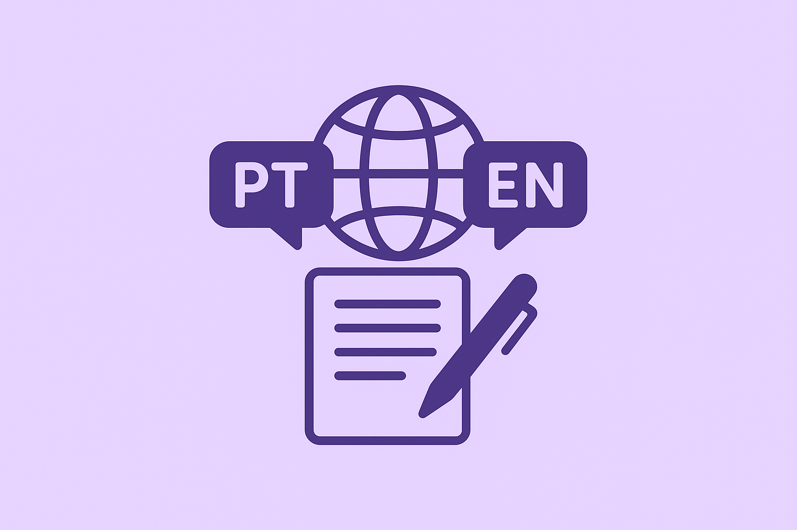
            

            <h3>Localization & Linguistic QA</h3>
            

                UX-driven localization focused on clarity, consistency, and effective communication across languages.
            

            
<strong>Skills:</strong> localization · UX writing · QA

            <a class="card-cta" href="https://github.com/pradoprojects/Translation_QA_Projects/">View Samples</a>
        

        <!-- 3 -->
        

            

                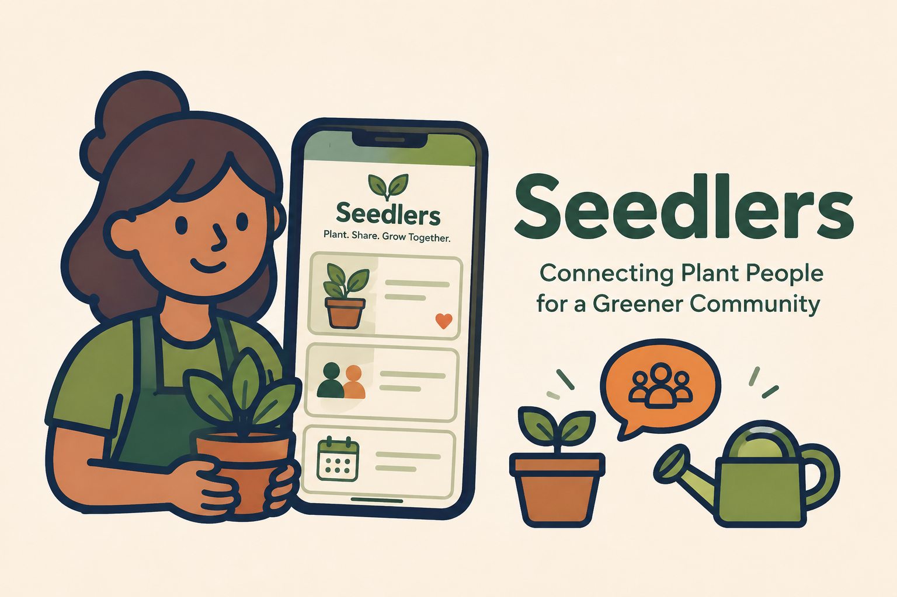
            

            <h3>Seedlers — UX Research & Product Design</h3>
            

                An end-to-end UX case study exploring how research, synthesis, and iterative design can foster community engagement through a plant-sharing platform.
            

            
<strong>Skills:</strong> UX research · personas · user flows · wireframes

            <a class="card-cta" href="https://github.com/pradoprojects/Seedlers">Learn More</a>
        

        <!-- 4 -->
        

            

                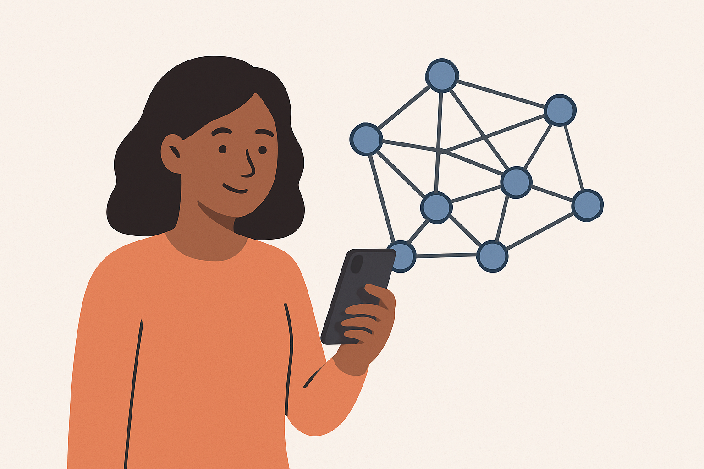
            

            <h3>Self-Learning App — Mobile UX</h3>
            

                A concept app focused on improving learning flows and access to educational content.
            

            
<strong>Skills:</strong> wireframes · flows · usability

            <a class="card-cta" href="https://github.com/pradoprojects/Self-Learning-App">Learn More</a>
        

        <!-- 5 -->
        

            

                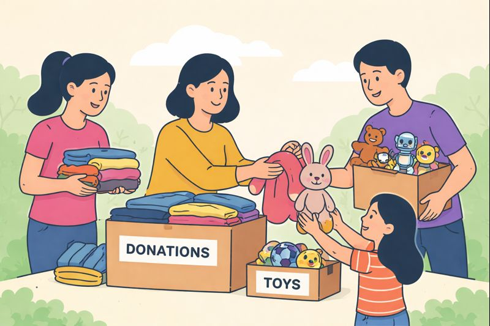
            

            <h3>DonActor — Donation UX</h3>
            

                A UX project exploring how to reduce friction and improve clarity in donation experiences.
            

            
<strong>Skills:</strong> research · wireframes · prototyping

            <a class="card-cta" href="https://github.com/pradoprojects/DonActor">Learn More</a>
        

        <!-- 6 -->
        

            

                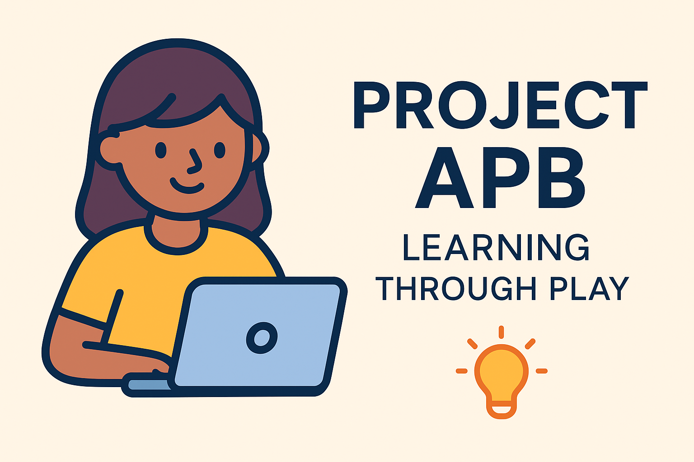
            

            <h3>Project APB — Learning Through Play</h3>
            

                Educational project involving accessible and engaging learning experiences.
            

            
<strong>Skills:</strong> research · ideation · prototyping

            <a class="card-cta" href="https://github.com/pradoprojects/Project-APB">Learn More</a>
        

        <!-- 7 -->
        

            

                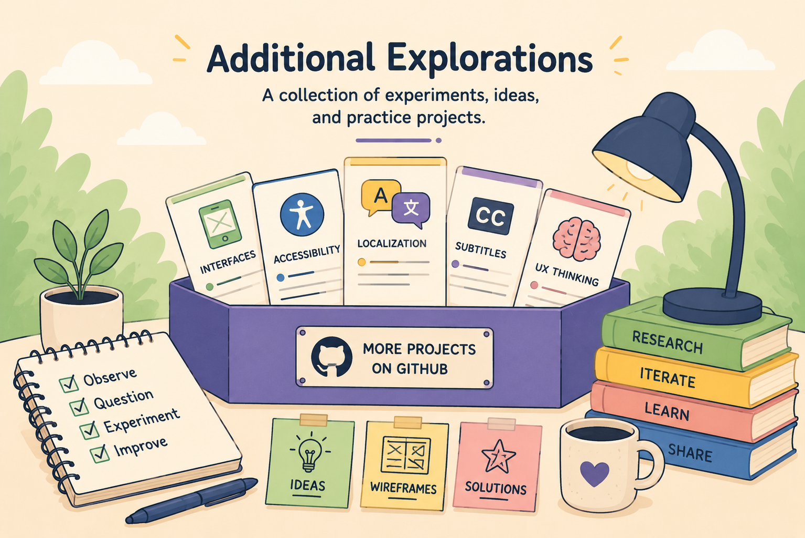
            

            <h3>Additional Explorations</h3>
            

                Smaller experiments and practice projects involving localization, interfaces,
                accessibility, subtitles, and UX thinking.
            

            
<strong>Skills:</strong> exploration · iteration · communication

            <a class="card-cta" href="https://github.com/pradoprojects">Explore More</a>
        

    

</section>

<section id="information-design">
    <h2>Information & Content Design 🧠</h2>

    <ul>
        <li>Designing content, flows, and materials that improve clarity and understanding</li>
        <li>Creating forms and systems to support data collection and information use</li>
        <li>Translating complex concepts into clear, accessible communication</li>
    </ul>
</section>

<section id="improving">
    <h2>What I’m Improving 🧱</h2>
    <ul>
        <li>Improving visual design and layout clarity</li>
        <li>Strengthening usability testing → synthesis → decisions</li>
        <li>Advancing UX writing and content workflows</li>
        <li>Expanding knowledge in information design and data communication</li>
    </ul>
</section>

<section id="tools">
    <h2>Tools 🛠</h2>
    

        I use tools to design and communicate information effectively:
          
        Figma, Miro, HTML/CSS, GitHub 
        MemoQ, MateCat (localization workflows) 
        Google Docs, spreadsheets, and documentation tools
    

</section>

<section id="contact">
    <h2>Let’s Connect 🤝</h2>
    

        <a href="mailto:marllospaiva@gmail.com">marllospaiva@gmail.com</a> •
        <a href="https://www.linkedin.com/in/marllos-p-a383641b2">LinkedIn</a>
    

</section>

</main>

